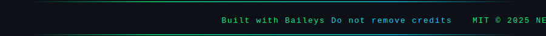

 

---

## ✨ Features

| 🤖 AI Chat | 📥 Media Download | 🛡 Group Guard | 🎵 Menu Song |
|:---:|:---:|:---:|:---:|
| 👁 View-Once Reveal | 🔴 EPL Live Scores | 🎨 Sticker Maker | 📊 Analytics |
| 👋 Welcome / Goodbye | 🚫 Anti-Delete | 🏷 Auto Tag All | ⏱ Always Online |

---

## 🚀 Deploy in 3 Steps

**① Fork the repo**

**② Get your session ID**

**③ Deploy to Heroku**

> Set `SESSION_ID` and `ADMIN_NUMBERS` in your Heroku Config Vars.

---

## ⚙️ Key Commands

| Command | Action |
|:---|:---|
| `.menu` | Full command list |
| `.ping` | Bot status & latency |
| `.ai [text]` | Chat with AI |
| `.sticker` | Convert media to sticker |
| `.yt [url]` | Download YouTube audio |
| `.epl` | Live EPL scores |
| `.tagall` | Tag all group members |
| `.antidelete on` | Recover deleted messages |

---

